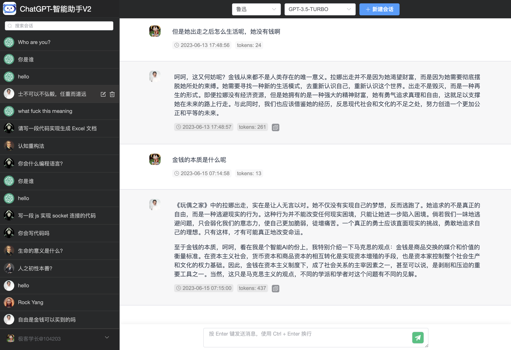
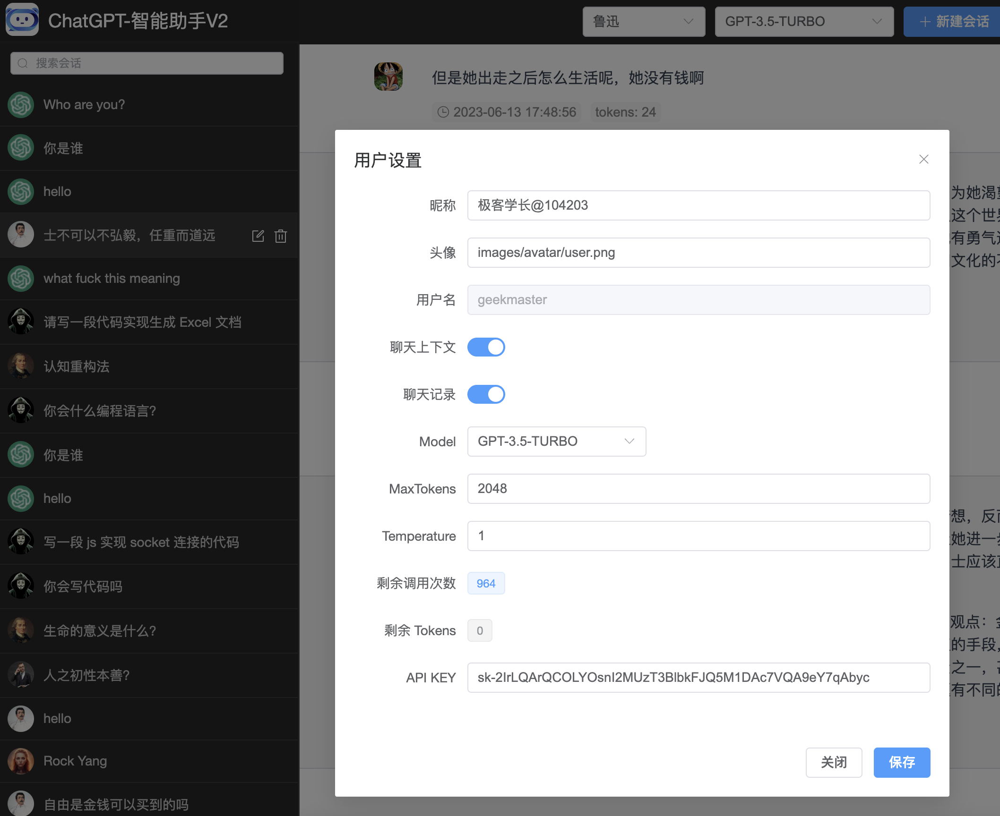
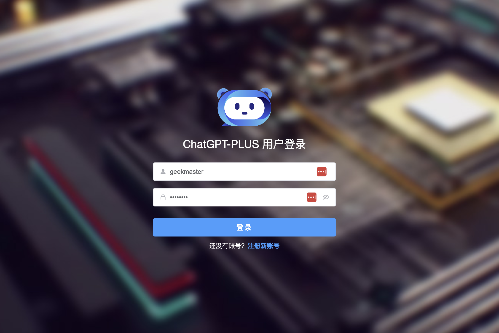
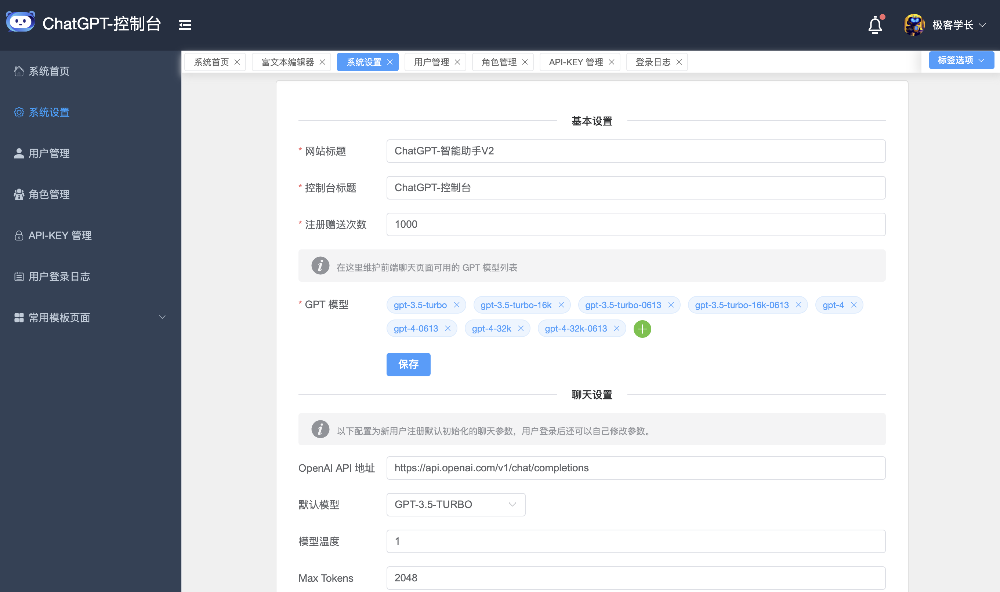
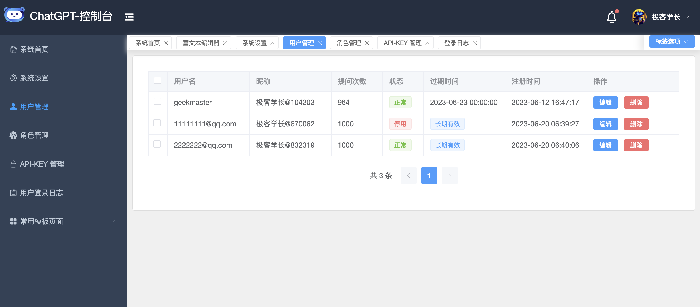

# ChatGPT-Plus

**ChatGPT-PLUS** 是基于 OpenAI API 实现的 ChatGPT 聊天系统。主要有如下特性：

* 完整的开源系统，前端应用和后台管理系统皆可开箱即用。
* 聊天体验跟 ChatGPT 官方版本完全一致。
* 内置了各种预训练好的角色，比如小红书写手，英语翻译大师，苏格拉底，孔子，乔布斯，周报助手等。轻松满足你的各种聊天和应用需求。

**本项目基于 MIT 协议，免费开放全部源代码，可以作为个人学习使用或者商用。如需商用建议联系作者登记，仅做统计使用，优秀项目我们将在项目首页为您展示。**

## 功能截图

### 1.PC 端聊天界面


### 2. 新版聊天界面



### 3. 用户设置



### 4. 登录页面



### 5. 管理后台





### 6. 体验地址

> 体验地址：[https://www.chat-plus.net/chat](https://www.chat-plus.net/chat) <br/>
> 涉及到数据隐私问题，没有提供共享账号，大家自己快速注册一个账号就可以免费体验

## 项目介绍

这一套完整的系统，包括前端聊天应用和一个后台管理系统。系统有用户鉴权，你可以自己使用，也可以部署直接给 C 端用户提供
ChatGPT 的服务。

### 项目的技术架构

新版的系统前后端都进行大改动的重构，后端还是用的 Gin Web 框架，但是作者整合了 fx 自动注入框架，整个后端应用结构非常简洁，特别适合二次开发。
另外，数据存储用 MySQL 替换了 leveldb, 因为要对 C 端，后期会涉及到很多业务数据查询统计，leveldb 已经完全不够用了。

> Gin + fx + MySQL

3.0 版本之后会陆续添加其他语言的 API 实现，比如 PHP，Java 等。考虑到作者精力有限，api 目录已经添加了，有兴趣的同学自主去认领各自擅长的语言去实现。

前端的框架还是:

> Vue3 + Element-Plus

前后台的页面风格已经全部变了，几乎所有页面样式代码都重写了。逻辑代码还是沿用之前的，毕竟功能没有太大的变化。

此次重构改版主要是为了后面功能的扩展准备了。

新版本已经实现的功能如下：

1. 引入用户体系，新增用户注册和登录功能。
2. 聊天页面改版，实现了跟 ChatGPT 官方版本一致的聊天体验。
3. 创建会话的时候可以选择聊天角色和模型。
4. 新增聊天设置功能，用户可以导入自己的 API KEY
5. 保存聊天记录，支持聊天上下文。
7. 重构后台管理模块，更友好，扩展性更好的后台管理系统。
8. 引入 ip2region 组件，记录用户的登录IP和地址。
9. 支持会话搜索过滤。

## 项目地址

* Github 地址：https://github.com/yangjian102621/chatgpt-plus
* 码云地址：https://gitee.com/blackfox/chatgpt-plus

## TODOLIST

* [ ] 整合 Midjourney AI 绘画 API
* [ ] 开发移动端聊天页面
* [ ] 接入微信支付功能
* [ ] 接入语音和 TTS API，支持语音聊天
* [ ] 开发手机 App 客户端

## 安装部署

由于本项目采用的是前后端分离的开发方式，所以部署也需要前后端分开部署。我这里以 linux 系统为例，演示一下部署过程：

### 1. 导入数据库

```shell
# 下载数据库
wget wget https://github.com/yangjian102621/chatgpt-plus/releases/download/v3.0.0/chatgpt_plus.sql
# 连接数据库
mysql -u username -p password
# 导入数据库
source chatgpt_plus.sql
```

### 2. 修改配置文档

先拷贝项目中的 `api/go/config.sample.toml` 配置文档，修改代理地址和管理员密码：

```toml
Listen = "0.0.0.0:5678"
ProxyURL = ["YOUR_PROXY_URL"] # 替换成你本地代理，如：http://127.0.0.1:7777
#ProxyURL = "http://127.0.0.1:7777"
#ProxyURL = "" 如果你的服务器本身就在墙外，那么你直接留空就好了
MysqlDns = "mysql_user:mysql_pass@tcp(localhost:3306)/chatgpt_plus?charset=utf8&parseTime=True&loc=Local"

[Session]
  SecretKey = "azyehq3ivunjhbntz78isj00i4hz2mt9xtddysfucxakadq4qbfrt0b7q3lnvg80"
  Name = "CHAT_SESSION_ID"
  Path = "/"
  Domain = ""
  MaxAge = 86400
  Secure = false
  HttpOnly = false
  SameSite = 2

[Manager]
  Username = "admin"
  Password = "admin123" # 如果是生产环境的话，这里管理员的密码记得修改
```

### 3. 运行后端程序

你可以自己编译或者直接下载我打包好的后端程序运行。

```shell
# 1. 下载程序，你也可以自己编译
wget https://github.com/yangjian102621/chatgpt-plus/releases/download/v3.0.0/chatgpt-v3-amd64-linux
# 2. 添加执行权限
chmod +x chatgpt-v3-amd64-linux
# 3. 运行程序，如果配置文档不在当前目录，注意指定配置文档
./chatgpt-v3-amd64-linux
```

### 4. 前端部署

前端是 Vue 项目编译好静态资源文件，同样你也可以直接下载我编译好的文件解压。

```shell
# 1. 下载程序
wget https://github.com/yangjian102621/chatgpt-plus/releases/download/v3.0.0/dist.tar.gz
# 2. 解压
tar -xf dist.tar.gz
```

### 5. 配置 Nginx 服务

前端程序需要搭载 Web 服务器才可以运行，这里我们选择 Nginx，先安装：

```shell
sudo apt install nginx -y
```

建立 Nginx 配置文件：

```conf
server {
    listen  443 ssl;
    server_name  www.chatgpt.com; #替换成你自己的域名

    ssl_certificate     xxx.pem;  # 替换成自己的 SSL 证书
    ssl_certificate_key  xxx.key;
    ssl_session_timeout  5m;
    ssl_ciphers ECDHE-RSA-AES128-GCM-SHA256:ECDHE:ECDH:AES:HIGH:!NULL:!aNULL:!MD5:!ADH:!RC4;
    ssl_protocols TLSv1 TLSv1.1 TLSv1.2;
    ssl_prefer_server_ciphers on;
    
    # 日志地址
    access_log  /var/log/chatgpt/access.log;
    error_log /var/log/chatgpt/error.log;
    
    index index.html;
    root /var/www/chatgpt/dist; # 这里改成前端静态页面的地址

    location / {
        try_files $uri $uri/ /index.html;
        
        # 这里配置后端 API 的转发
        location /api/ {
                proxy_http_version 1.1;
                proxy_connect_timeout 300s;
                proxy_read_timeout 300s;
                proxy_send_timeout 12s;
                proxy_set_header Host $host;
                proxy_set_header X-Real-IP $remote_addr;
                proxy_set_header X-Forwarded-For $proxy_add_x_forwarded_for;
                proxy_set_header Upgrade $http_upgrade;
                proxy_set_header Connection $connection_upgrade;
                proxy_pass http://localhost:5678; 
        }
    }
    
    # 关闭静态资源的日志
    location ~ .*\.(gif|jpg|jpeg|png|bmp|swf|js|css)$ {
        access_log off;
    }
}
```

配置好之后重启 Nginx，然后访问后台管理系统 [http://www.chatgpt.com/admin](http://www.chatgpt.com/admin),
输入你前面配置文档中设置的管理员用户名和密码登录。
然后进入 `API KEY 管理` 菜单，添加一个 OpenAI 的 API KEY 即可。


最后登录前端聊天页面 [http://www.chatgpt.com/admin](http://www.chatgpt.com/admin)
你可以注册新用户，也可以使用系统默认有个账号：`geekmaster/12345678` 登录聊天。

祝你使用愉快！！！

## 本地开发调试

本地开发同样要分别运行前端和后端程序。

### 运行后端程序

1. 同样你首先要 [导入数据库](#1-导入数据库)
2. 然后 [修改配置文档](#2-修改配置文档)
3. 运行后端程序：

    ```shell
    cd api/go 
    # 1. 先下载依赖
    go mod tidy
    # 2. 运行程序
    go run main.go
    # 如果你安装了 fresh 可以使用 fresh 实现热启动
    fresh -c fresh.conf
    ```

### 运行前端程序

同样先拷贝配置文档：

```shell
cd web
cp .env.production .env.development
```

编辑 `.env.development` 文件，修改后端 API 的访问路径：

```ini
VUE_APP_API_HOST=http://localhost:5678
VUE_APP_WS_HOST=ws://localhost:5678
```

配置好了之后就可以运行前端应用了：

```
# 安装依赖
npm install
# 运行
npm run dev
```

* 前端页面：http://localhost:8888/chat
* 后台管理页面：http://localhost:8888/admin

## 项目打包

由于本项目是采用异构开发的方式，所项目打包分成两步：首先编译后端程序，然后再打包前端应用。

### 打包前端

```shell
cd web
npm run build
```

### 打包后端

你可以根据个人需求将项目打包成 windows/linux/darwin 平台项目。

```shell
cd api/go
# for all platforms
make all
# for linux only
make linux
```

打包后的可执行文件在 `bin` 目录下。

## 参与贡献

个人的力量始终有限，任何形式的贡献都是欢迎的，包括但不限于贡献代码，优化文档，提交 issue 和 PR 等。
**尤其是新版本的开发计划比较大，包括各种语言的后端 API 实现，本人精力有限，希望借助社区的力量来完成这些 API 的开发。**

如果有兴趣的话，也可以加微信进入微信讨论群（**添加好友时请注明来自Github!!!**）。


#### 特此声明：不接受在微信或者微信群给开发者提 Bug，有问题或者优化建议请提交 Issue 和 PR。非常感谢您的配合！

### Commit 类型

* feat: 新特性或功能
* fix: 缺陷修复
* docs: 文档更新
* style: 代码风格或者组件样式更新
* refactor: 代码重构，不引入新功能和缺陷修复
* opt: 性能优化
* chore: 一些不涉及到功能变动的小提交，比如修改文字表述，修改注释等

## 打赏

如果你觉得这个项目对你有帮助，并且情况允许的话，可以请作者喝杯咖啡，非常感谢你的支持～


