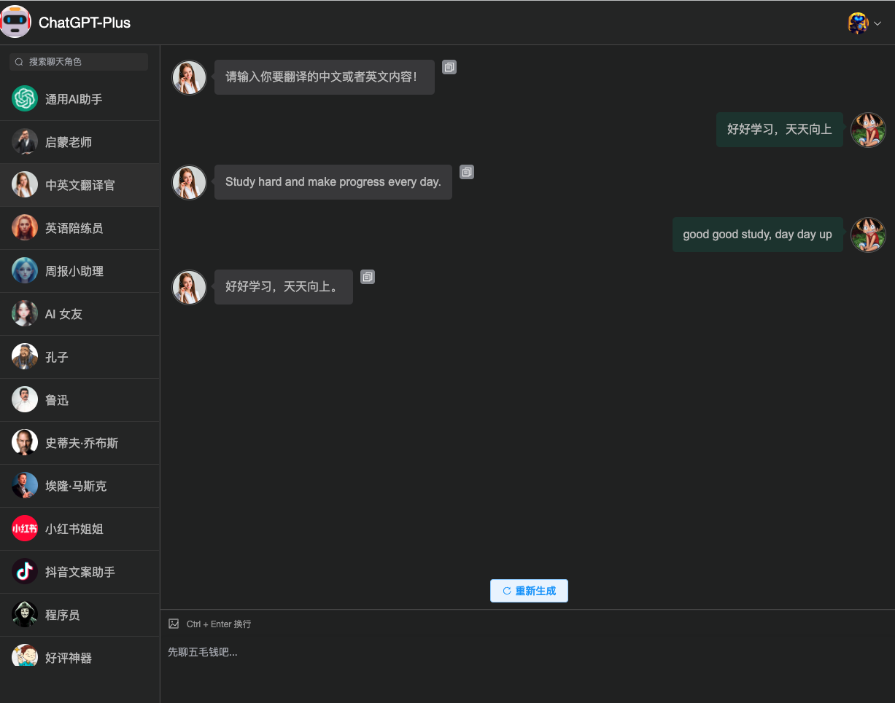
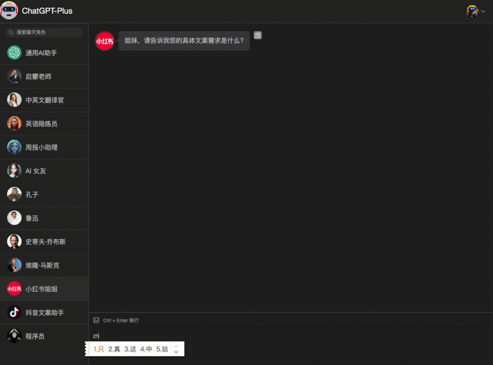
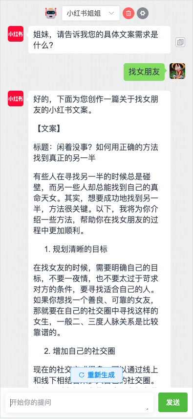
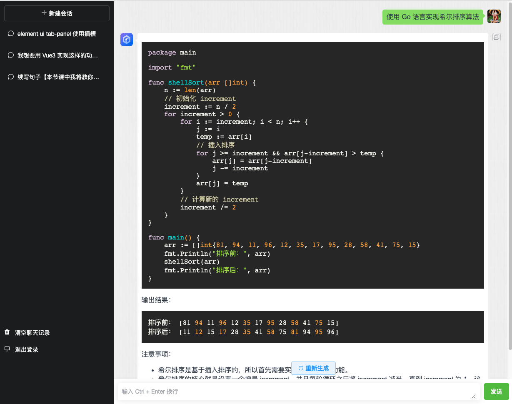
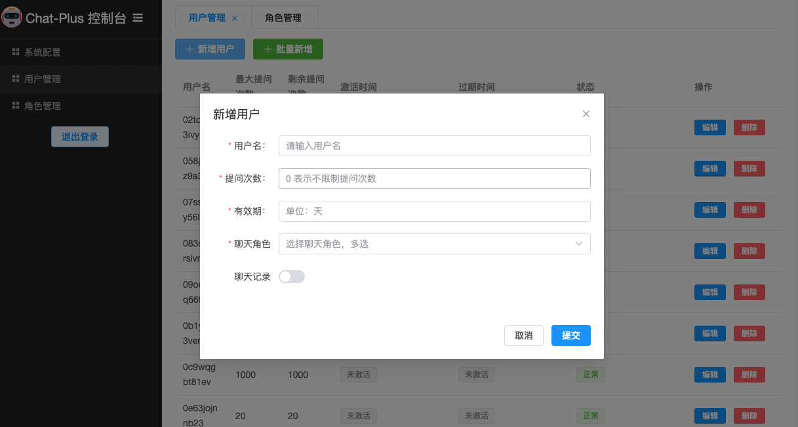
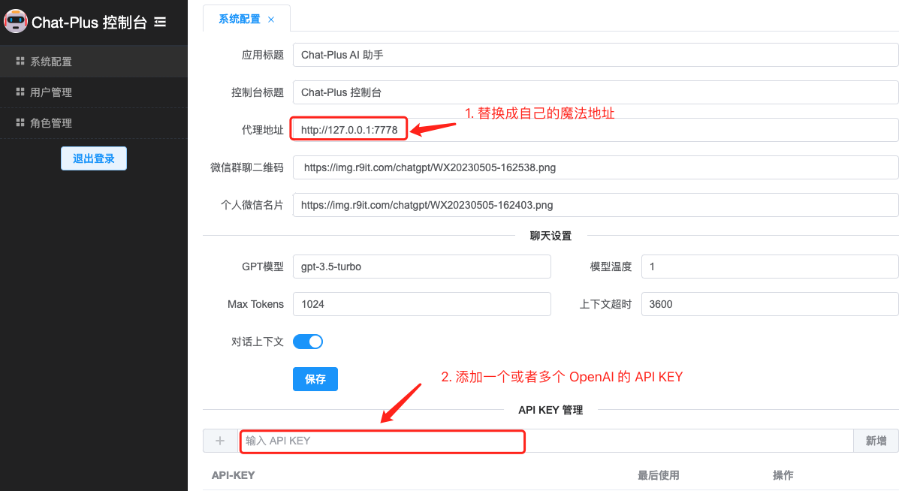
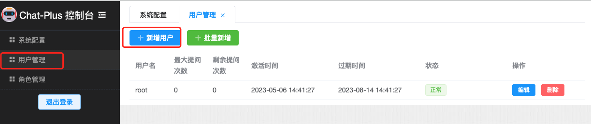

# ChatGPT-Plus

基于 OpenAI API 实现的 ChatGPT Web 应用，一共分为两个版本：

* 通用版：交互体验跟 ChatGPT 官方一致，聊天记录保存在客户端（浏览器）
* 角色版：内置了各种预训练好的角色，比如小红书写手，英语翻译大师，苏格拉底，孔子，乔布斯，周报助手等。轻松满足你的各种聊天和应用需求。
聊天记录保存在云端（可以配置是否保存聊天记录）
每个版本都有 PC 版和移动版，PC 版本的体验要略优于移动版。

**本项目基于 MIT 协议，免费开放全部源代码，可以作为个人学习使用或者商用。如需商用建议联系作者登记，仅做统计使用，优秀项目我们将在项目首页为您展示。**

## 功能截图

### 1. 角色版PC端




### 2. 角色版移动端


### 3. 通用版


### 4. 管理后台




### 5. 体验地址
> 体验地址：[https://www.chat-plus.net/chat/#/free](https://www.chat-plus.net/chat/#/free) <br/>
> 口令：GeekMaster

## 项目介绍
这一套完整的系统，包括两套前端聊天应用和一个后台管理系统。系统有用户鉴权，你可以自己使用，也可以部署直接给 C 端用户提供 ChatGPT 的服务。

项目的技术架构是

> Go + Vue3 + element-plus

后端采用的是 Go 语言开发的 Gin Web 框架。前端用的是 Vue3 + element-plus UI 框架

目前已经实现了以下功能：
1. 通用版的 ChatGPT 聊天界面和功能，聊天记录保存在客户端。
2. 口令机制：输入口令才可以访问，支持设置口令的对话次数，有效期。
3. 角色版的聊天界面和功能，角色设定，预设一些角色，比如程序员，客服，作家，老师，艺术家... 
4. 保存聊天记录，支持聊天上下文。 
5. OpenAI API 负载均衡，限制每个 API Key 每分钟之内调用次数不超过 15次，防止被封。 
6. 支持配置多个代理，保证高可用。 
7. 实现 markdown 语法解析和代码高亮，支持复制回复内容功能。 
8. 后台管理功能，实现系统的动态配置，用户和角色的动态管理。

## 项目地址
* Github 地址：https://github.com/yangjian102621/chatgpt-plus
* 码云地址：https://gitee.com/blackfox/chatgpt-plus

## TODOLIST
* [ ] 让用户配置自己的 API KEY，调用自己的 API Key，将不记 Token 的使用次数
* [ ] 嵌入 AI 绘画功能，支持根据描述词生成图片
* [ ] 接入自己训练的开源大语言模型
* [ ] 接入 Google 语音 API，支持语音聊天

## 快速本地部署
如果你想在本地快速尝鲜一下，你可以直接下载我打包好的一键运行包，然后直接运行就好了，就这么简单。
支持 windows, linux 和 Mac 系统，[GitHub 下载地址](https://github.com/yangjian102621/chatgpt-plus/releases)。
   
我这里以 linux 系统为例，演示一下部署过程：

```shell
# 1. 下载程序
wget https://github.com/yangjian102621/chatgpt-plus/releases/download/v2.0.0/wechatGPT-amd64-linux
# 2. 添加执行权限
chmod +x wechatGPT-amd64-linux
# 3. 运行程序
./wechatGPT-amd64-linux 
```
服务启动成功之后直接访问后台管理页面(http://localhost:5678/chat/#/admin)，初始用户名和密码分别为 `admin` 和 `admin123`。

修改系统配置。这里主要配置 OpenAI 的 [API KEY](https://platform.openai.com/account/api-keys) 和魔法，因为调用 OpenAI 的 API 需要魔法。



最后，你还需要一个口令来访问 ChatGPT 前端应用。直接在【后台管理系统->用户管理】新增一个用户就好了。



**切记要先退出后台登录，再登录前端应用！！！前后端账号权限不一致。**

然后直接使用用户名登录前端应用：

* 角色版：http://localhost:5678/chat/#/plus 
* 普通版：http://localhost:5678/chat/#/free

祝你使用愉快！

## 本地开发调试
本项目的技术架构是

> Go + Vue3 + element-plus

所以你需要提前安装好 Go（1.19以上）语言环境和 Nodejs 环境。

### 1. 运行后端程序

首先，我们需要拷贝默认的配置文档：
```shell
cd src
cp config.sample.toml config.toml
```
然后，我们需要修改配置文档，需要修改的有三处，一个是魔法，第二个是 API KEY，第三个是修改 Session 跨域的域名。因为我们前后端是分离的，所以必须解决前端访问跨域的问题。

```toml
ProxyURL = ["YOUR_PROXY_URL"] # 替换成你本地代理，如：http://127.0.0.1:7777

[Session]
  SecretKey = "azyehq3ivunjhbntz78isj00i4hz2mt9xtddysfucxakadq4qbfrt0b7q3lnvg80"
  Name = "CHAT_SESSION_ID"
  Path = "/"
  Domain = "172.22.11.200" # 这里需要改成你当前机器的内网 IP 地址
  MaxAge = 86400
  Secure = false
  HttpOnly = false
  SameSite = 2
  
[[Chat.ApiKeys]] # API KEY 可以添加多个，自动负载均衡
Value = "YOUR_OPENAI_API_KEY" # 这里替换成你的 OpenAI API KEY: sk-xxxx
LastUsed = 0
```

修改之后运行后端程序：

```shell
# 1. 先下载依赖
go mod tidy
# 2. 运行程序
go run main.go
```
  
### 2. 运行前端程序
同样先拷贝配置文档：
```shell
cd web
cp .env.production .env.development
```
编辑 `.env.development` 文件，修改后端 API 的访问路径：

```ini
VUE_APP_API_HOST=http://172.22.11.200:5678 # 这里也是需要把 IP 替换成你本地的内网 IP 地址
VUE_APP_WS_HOST=ws://172.22.11.200:5678
```

配置好了之后就可以运行前端应用了：
```
# 安装依赖
npm install
# 运行
npm run dev
```

启动之后通过**内网地址**访问后台管理页面：http://172.22.11.200:8888/chat/#/admin ，添加一个用户就可以开始测试了。

## 项目打包
由于本项目是采用异构开发的方式，所项目打包分成两步：首先打包前端应用，然后再将打包后前端文件打包进后端应用，最后打成一个包。

### 打包前端
首先你还是需要修改配置文档 `.env.production`，指定你线上部署的域名。

```ini
VUE_APP_API_HOST=https://www.chat-plus.net # API 请求主机
VUE_APP_WS_HOST=wss://www.chat-plus.net # websocket 请求主机
```

执行打包
```shell
npm run build
```

### 打包后端
你可以根据个人需求将项目打包成 windows/linux/darwin 平台项目。
```shell
# for all platforms
make all
# for linux only
make linux
```
打包后的可执行文件在 `src/bin` 目录下。

### 线上部署 
部署方式跟 [快速本地部署](#快速本地部署) 一样，将打包好的可执行文件在线上服务器运行即可。

> **特别注意：** 线上发布请记得修改配置文档中的 AccessKey， 以免给你的应用造成风险！！！

**另外，如果你部署在国外的服务器，那么就不需要配置代理，直接留空就行了。**

```shell
ProxyURL = []
```
### 使用 Nginx 代理

```nginx
# 这里需要配置允许 Websocket 请求转发，非常重要
map $http_upgrade $connection_upgrade {
     default upgrade;
     'websocket'      upgrade;
}

server {
    listen  443 ssl;
    server_name  www.chat-plus.net;

    ssl_certificate     xxx.pem; # SSL 证书
    ssl_certificate_key  xxx.key;
    ssl_session_timeout  5m;
    ssl_ciphers ECDHE-RSA-AES128-GCM-SHA256:ECDHE:ECDH:AES:HIGH:!NULL:!aNULL:!MD5:!ADH:!RC4;
    ssl_protocols TLSv1 TLSv1.1 TLSv1.2;
    ssl_prefer_server_ciphers on;

    underscores_in_headers on;
    access_log  /var/log/chatgpt/access.log;
    error_log /var/log/chatgpt/error.log;

    location / {
        proxy_http_version 1.1;
	    proxy_read_timeout 300s;
        proxy_send_timeout 300s;
        proxy_set_header Host $host;
        proxy_set_header X-Real-IP $remote_addr;
        proxy_set_header X-Forwarded-For $proxy_add_x_forwarded_for;

	    proxy_set_header Upgrade $http_upgrade;
        proxy_set_header Connection $connection_upgrade;
        proxy_pass http://127.0.0.1:5678;


    }

    # 关闭静态资源日志
    location ~ .*\.(gif|jpg|jpeg|png|bmp|swf|js|css)$ {
	proxy_pass http://127.0.0.1:5678;
        access_log off;
    }
}
```

## 参与贡献

个人的力量始终有限，任何形式的贡献都是欢迎的，包括但不限于贡献代码，优化文档，提交 issue 和 PR 等。

