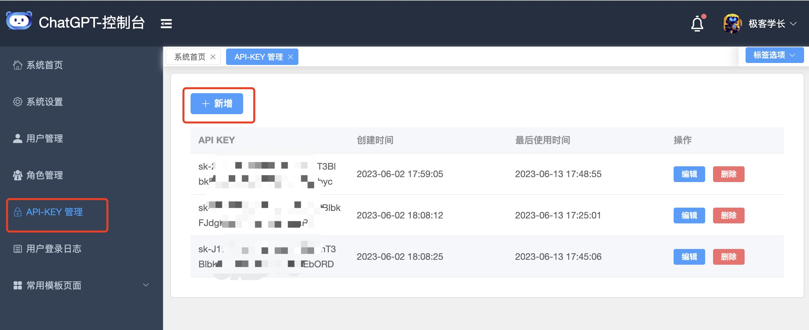

# ChatGPT-Plus

**ChatGPT-PLUS** 基于 AI 大语言模型 API 实现的 AI 助手全套开源解决方案，自带运营管理后台，开箱即用。集成了 OpenAI, Azure,
ChatGLM,讯飞星火，文心一言等多个平台的大语言模型。集成了 MidJourney 和 Stable Diffusion AI绘画功能。主要有如下特性：

* 完整的开源系统，前端应用和后台管理系统皆可开箱即用。
* 基于 Websocket 实现，完美的打字机体验。
* 内置了各种预训练好的角色应用，比如小红书写手，英语翻译大师，苏格拉底，孔子，乔布斯，周报助手等。轻松满足你的各种聊天和应用需求。
* 支持 OPenAI，Azure，文心一言，讯飞星火，清华 ChatGLM等多个大语言模型。
* 支持 MidJourney / Stable Diffusion AI 绘画集成，开箱即用。
* 支持使用个人微信二维码作为充值收费的支付渠道，无需企业支付通道。
* 已集成支付宝支付功能，支持多种会员套餐和点卡购买功能。
* 集成插件 API 功能，可结合大语言模型的 function 功能开发各种强大的插件，已内置实现了微博热搜，今日头条，今日早报和 AI
  绘画函数插件。

## 功能截图

### PC 端聊天界面


### AI 对话界面


### MidJourney 专业绘画界面


### Stable-Diffusion 专业绘画页面


### 绘图作品展


### AI应用列表


### 会员充值


### 自动调用函数插件


### 管理后台


### 移动端 Web 页面


### 7. 体验地址

> 免费体验地址：[https://ai.r9it.com/chat](https://ai.r9it.com/chat) <br/>
> **注意：请合法使用，禁止输出任何敏感、不友好或违规的内容！！！**

## 使用须知

1. 本项目基于 MIT 协议，免费开放全部源代码，可以作为个人学习使用或者商用。
2. 如需商用必须保留版权信息，请自觉遵守。确保合法合规使用，在运营过程中产生的一切任何后果自负，与作者无关。

## 项目介绍

这一套完整的系统，包括前端聊天应用和一个后台管理系统。系统有用户鉴权，你可以自己使用，也可以部署直接给 C 端用户提供
ChatGPT 的服务。

### 项目的技术架构

新版的系统前后端都进行大改动的重构，后端还是用的 Gin Web 框架，但是作者整合了 fx 自动注入框架，整个后端应用结构非常简洁，特别适合二次开发。
另外，数据存储用 MySQL 替换了 leveldb, 因为要对 C 端，后期会涉及到很多业务数据查询统计，leveldb 已经完全不够用了。

> Gin + fx + MySQL

3.0 版本之后会陆续添加其他语言的 API 实现，比如 PHP，Java 等。考虑到作者精力有限，api 目录已经添加了，有兴趣的同学自主去认领各自擅长的语言去实现。

前端的框架还是:

> Vue3 + Element-Plus

前后台的页面风格已经全部变了，几乎所有页面样式代码都重写了。逻辑代码还是沿用之前的，毕竟功能没有太大的变化。

此次重构改版主要是为了后面功能的扩展准备了。

新版本已经实现的功能如下：

1. 引入用户体系，新增用户注册和登录功能。
2. 聊天页面改版，实现了跟 ChatGPT 官方版本一致的聊天体验。
3. 创建会话的时候可以选择聊天角色和模型。
4. 新增聊天设置功能，用户可以导入自己的 API KEY
5. 保存聊天记录，支持聊天上下文。
6. 重构后台管理模块，更友好，扩展性更好的后台管理系统。
7. 引入 ip2region 组件，记录用户的登录IP和地址。
8. 支持会话搜索过滤。
9. 支持微信支付充值

## 项目地址

* Github 地址：https://github.com/yangjian102621/chatgpt-plus
* 码云地址：https://gitee.com/blackfox/chatgpt-plus

## 客户端下载

目前已经支持 Win/Linux/Mac/Android 客户端，下载地址为：https://github.com/yangjian102621/chatgpt-plus/releases/tag/v3.1.2

## TODOLIST

* [x] 整合 Midjourney AI 绘画 API
* [x] 开发移动端聊天页面
* [x] 接入微信收款功能
* [x] 支持 ChatGPT 函数功能，通过函数实现插件
* [x] 开发桌面版应用
* [x] 开发手机 App 客户端
* [x] 支付宝支付功能
* [ ] 支持基于知识库的 AI 问答
* [ ] 会员推广功能
* [ ] 微信支付功能

## Docker 快速部署

>
鉴于最新不少网友反馈在部署的时候遇到一些问题，大部分问题都是相同的，所以我这边做了一个视频教程 [五分钟部署自己的 ChatGPT 服务](https://www.bilibili.com/video/BV1H14y1B7Qw/)。
> 习惯看视频教程的朋友可以去看视频教程，视频的语速比较慢，建议 2 倍速观看。

V3.0.0 版本以后已经支持使用容器部署了，跳过所有的繁琐的环境准备，一条命令就可以轻松部署上线。

### 1. 导入数据库

首先我们需要创建一个 MySQL 容器，并导入初始数据库。

```shell
cd docker/mysql
# 创建 mysql 容器
docker-compose up -d
# 导入数据库
docker exec -i chatgpt-plus-mysql sh -c 'exec mysql -uroot -p12345678' < ../../database/chatgpt_plus-v3.1.8.sql
```

如果你本地已经安装了 MySQL 服务，那么你只需手动导入数据库即可。

```shell
# 连接数据库
mysql -u username -p password
# 导入数据库
source database/chatgpt_plus.sql
```

### 2. 修改配置文档

修改配置文档 `docker/conf/config.toml` 配置文档，修改代理地址和管理员密码：

```toml
Listen = "0.0.0.0:5678"
ProxyURL = "" # 如 http://127.0.0.1:7777
MysqlDns = "root:12345678@tcp(172.22.11.200:3307)/chatgpt_plus?charset=utf8&parseTime=True&loc=Local"
StaticDir = "./static" # 静态资源的目录
StaticUrl = "/static" # 静态资源访问 URL
AesEncryptKey = ""
WeChatBot = false # 是否启动微信机器人

[Session]
  SecretKey = "azyehq3ivunjhbntz78isj00i4hz2mt9xtddysfucxakadq4qbfrt0b7q3lnvg80" # 注意：这个是 JWT Token 授权密钥，生产环境请务必更换
  MaxAge = 86400

[Manager]
  Username = "admin"
  Password = "admin123" # 如果是生产环境的话，这里管理员的密码记得修改
  
[Redis] # redis 配置信息
  Host = "localhost" 
  Port = 6379
  Password = ""
  DB = 0
  
[ApiConfig] # 微博热搜，今日头条等函数服务 API 配置，此为第三方插件服务，如需使用请联系作者开通
  ApiURL = ""
  AppId = ""
  Token = ""

[SmsConfig] # 阿里云短信服务配置
  AccessKey = ""
  AccessSecret = ""
  Product = "Dysmsapi"
  Domain = "dysmsapi.aliyuncs.com"

[ExtConfig] # MidJourney和微信机器人服务 API 配置，开通此功能需要配合 chatpgt-plus-exts 项目部署
  ApiURL = "" # 插件扩展 API 地址
  Token = "" # 这个 token 随便填，只要确保跟 chatgpt-plus-exts 项目的 token 一样就行 
  
[OSS] # OSS 配置，用于存储 MJ 绘画图片
   Active = "local" # 默认使用本地文件存储引擎
   [OSS.Local]
     BasePath = "./static/upload" # 本地文件上传根路径
     BaseURL = "http://localhost:5678/static/upload" # 本地上传文件根 URL 如果是线上，则直接设置为 /static/upload 即可
   [OSS.Minio]
     Endpoint = "" # 如 172.22.11.200:9000
     AccessKey = "" # 自己去 Minio 控制台去创建一个 Access Key
     AccessSecret = ""
     Bucket = "chatgpt-plus" # 替换为你自己创建的 Bucket，注意要给 Bucket 设置公开的读权限，否则会出现图片无法显示。
     UseSSL = false
     Domain = "" # 地址必须是能够通过公网访问的，否则会出现图片无法显示。
   [OSS.QiNiu] # 七牛云 OSS 配置
       Zone = "z2" # 区域，z0：华东，z1: 华北，na0：北美，as0：新加坡
       AccessKey = ""
       AccessSecret = ""
       Bucket = ""
       Domain = "" # OSS Bucket 所绑定的域名，如 https://img.r9it.com
       
[MjConfig] # MidJourney AI 绘画配置
  Enabled = false # 是否启动 MidJourney 机器人服务
  UserToken = "" # 用户授权 Token
  BotToken = "" # Discord 机器人 Token
  GuildId = "" # 服务器 ID
  ChanelId = "" # 频道 ID

[SdConfig]
  Enabled = false # 是否启动 Stable Diffusion 机器人服务
  ApiURL = "http://172.22.11.200:7860" # stable-diffusion-webui API 地址
  ApiKey = "" # 如果开启了授权，这里需要配置授权的 ApiKey
  Txt2ImgJsonPath = "res/text2img.json" # 文生图的 API 请求报文 json 模板，允许自定义请求json报文，因为不同版本的 API 绘图的参数以及 fn_index 会不同。
  
[XXLConfig] # xxl-job 配置，需要你部署 XXL-JOB 定时任务工具，用来定期清理未支付订单和清理过期 VIP，如果你没有启用支付服务，则该服务也无需启动
  Enabled = false # 是否启用 XXL JOB 服务
  ServerAddr = "http://172.22.11.47:8080/xxl-job-admin" # xxl-job-admin 管理地址
  ExecutorIp = "172.22.11.47" # 执行器 IP 地址
  ExecutorPort = "9999" # 执行器服务端口
  AccessToken = "xxl-job-api-token" # 执行器 API 通信 token
  RegistryKey = "chatgpt-plus" # 任务注册 key

[AlipayConfig]
  Enabled = false # 启用支付宝支付通道
  SandBox = false # 是否启用沙盒模式
  UserId = "2088721020750581" # 商户ID
  AppId = "9021000131658023" # App Id
  PrivateKey = "certs/alipay/privateKey.txt" # 应用私钥
  PublicKey = "certs/alipay/appPublicCert.crt" # 应用公钥证书
  AlipayPublicKey = "certs/alipay/alipayPublicCert.crt" # 支付宝公钥证书
  RootCert = "certs/alipay/alipayRootCert.crt" # 支付宝根证书
  NotifyURL = "http://r9it.com:6004/api/payment/alipay/notify" # 支付异步回调地址
```

> 1. 如果你不知道如何获取 Discord 用户 Token 和 Bot Token
     请查参考 [Midjourney｜如何集成到自己的平台](https://zhuanlan.zhihu.com/p/631079476)。
> 2. `Txt2ImgJsonPath`
     的默认用的是使用最广泛的 [stable-diffusion-webui](https://github.com/AUTOMATIC1111/stable-diffusion-webui) 项目的
     API，如果你用的是其他版本，比如秋叶的懒人包部署的，那么请将对应的 text2img 的参数报文复制放在 `res/text2img.json`
     文件中即可。

修改 nginx 配置文档 `docker/conf/nginx/conf.d/chatgpt-plus.conf`，把后端转发的地址改成当前主机的内网 IP 地址。

```shell
 # 这里配置后端 API 的转发
location /api/ {
       proxy_http_version 1.1;
       proxy_connect_timeout 300s;
       proxy_read_timeout 300s;
       proxy_send_timeout 12s;
       proxy_set_header Host $host;
       proxy_set_header X-Real-IP $remote_addr;
       proxy_set_header X-Forwarded-For $proxy_add_x_forwarded_for;
       proxy_set_header Upgrade $http_upgrade;
       proxy_set_header Connection $connection_upgrade;
       proxy_pass http://172.28.173.76:6789; # 这里改成后端服务的内网 IP 地址
       
# 静态资源转发
location /static/ {
   proxy_pass http://172.22.11.47:5678; # 这里改成后端服务的内网 IP 地址
}
}
```

### 3. 启动应用

先修改 `docker/docker-compose.yaml` 文件中的镜像地址，改成最新的版本：

```yaml
version: '3'
services:
  # 后端 API 镜像
  chatgpt-plus-api:
    image: registry.cn-shenzhen.aliyuncs.com/geekmaster/chatgpt-plus-api:v3.1.8 #这里改成最新的 release 版本
    container_name: chatgpt-plus-api
    restart: always
    environment:
      - DEBUG=false
      - LOG_LEVEL=info
      - CONFIG_FILE=config.toml
    ports:
      - "5678:5678"
    volumes:
      - /usr/share/zoneinfo/Asia/Shanghai:/etc/localtime
      - ./conf/config.toml:/var/www/app/config.toml
      - ./logs:/var/www/app/logs
      - ./static:/var/www/app/static

  # 前端应用镜像
  chatgpt-plus-web:
    image: registry.cn-shenzhen.aliyuncs.com/geekmaster/chatgpt-plus-web:v3.1.8 #这里改成最新的 release 版本
    container_name: chatgpt-plus-web
    restart: always
    ports:
      - "8080:8080" # 这边是对外的端口，支持 8080，80和443
    volumes:
      - ./logs/nginx:/var/log/nginx
      - ./conf/nginx/conf.d:/etc/nginx/conf.d
      - ./conf/nginx/nginx.conf:/etc/nginx/nginx.conf
      - ./ssl:/etc/nginx/ssl
```

```shell
cd docker
docker-compose up -d
```

* 前端访问地址：http://localhost:8080/chat
* 后台管理地址：http://localhost:8080/admin
* 移动端地址：http://localhost:8080/mobile

> 注意：你得访问后台管理系统 http://localhost:8080/admin
> 输入你前面配置文档中设置的管理员用户名和密码登录。
> 然后进入 `API KEY 管理` 菜单，添加一个 OpenAI 的 API KEY 才可以正常开启 AI 对话。



最后进入前端聊天页面 [http://localhost:8080/chat](http://localhost:8080/chat)
你可以注册新用户，也可以使用系统默认有个账号：`18575670125/12345678` 登录聊天。

祝你使用愉快！！！

## 本地开发调试

本地开发同样要分别运行前端和后端程序。

### 运行后端程序

1. 同样你首先要 [导入数据库](#1-导入数据库)
2. 然后 [修改配置文档](#2-修改配置文档)
3. 运行后端程序：

    ```shell
    cd api 
    # 1. 先下载依赖
    go mod tidy
    # 2. 运行程序
    go run main.go
    # 如果你安装了 fresh 可以使用 fresh 实现热启动
    fresh -c fresh.conf
    ```

### 运行前端程序

同样先拷贝配置文档：

```shell
cd web
cp .env.production .env.development
```

编辑 `.env.development` 文件，修改后端 API 的访问路径：

```ini
VUE_APP_API_HOST=http://localhost:5678
VUE_APP_WS_HOST=ws://localhost:5678
```

配置好了之后就可以运行前端应用了：

```
# 安装依赖
npm install
# 运行
npm run dev
```

* 前端页面：http://localhost:8888/chat
* 后台管理页面：http://localhost:8888/admin

## 项目打包

由于本项目是采用异构开发的方式，所项目打包分成两步：首先编译后端程序，然后再打包前端应用。

### 打包前端

```shell
cd web
npm run build
```

### 打包后端

你可以根据个人需求将项目打包成 windows/linux/darwin 平台项目。

```shell
cd api
# for all platforms
make clean all
# for linux only
make clean linux
```

打包后的可执行文件在 `bin` 目录下。

## 参与贡献

个人的力量始终有限，任何形式的贡献都是欢迎的，包括但不限于贡献代码，优化文档，提交 issue 和 PR 等。

如果有兴趣的话，也可以加微信进入微信讨论群（**添加好友时请注明来自Github!!!**）。


#### 特此声明：不接受在微信或者微信群给开发者提 Bug，有问题或者优化建议请提交 Issue 和 PR。非常感谢您的配合！

### Commit 类型

* feat: 新特性或功能
* fix: 缺陷修复
* docs: 文档更新
* style: 代码风格或者组件样式更新
* refactor: 代码重构，不引入新功能和缺陷修复
* opt: 性能优化
* chore: 一些不涉及到功能变动的小提交，比如修改文字表述，修改注释等

## 打赏

如果你觉得这个项目对你有帮助，并且情况允许的话，可以请作者喝杯咖啡，非常感谢你的支持～


